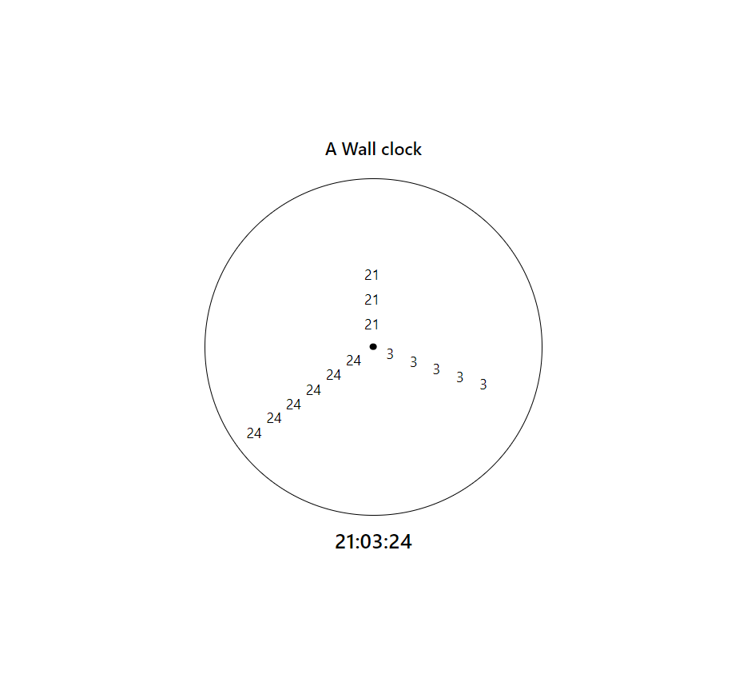

## React + TypeScript + Vite

React Tailwind Numbered Wall Clock
This project is a modern interpretation of the traditional wall clock, developed using React, Tailwind CSS, and Vite. Instead of conventional clock hands, it utilizes numbers arranged in a circular fashion to indicate the time, offering a unique and stylish way to display time on your wall.